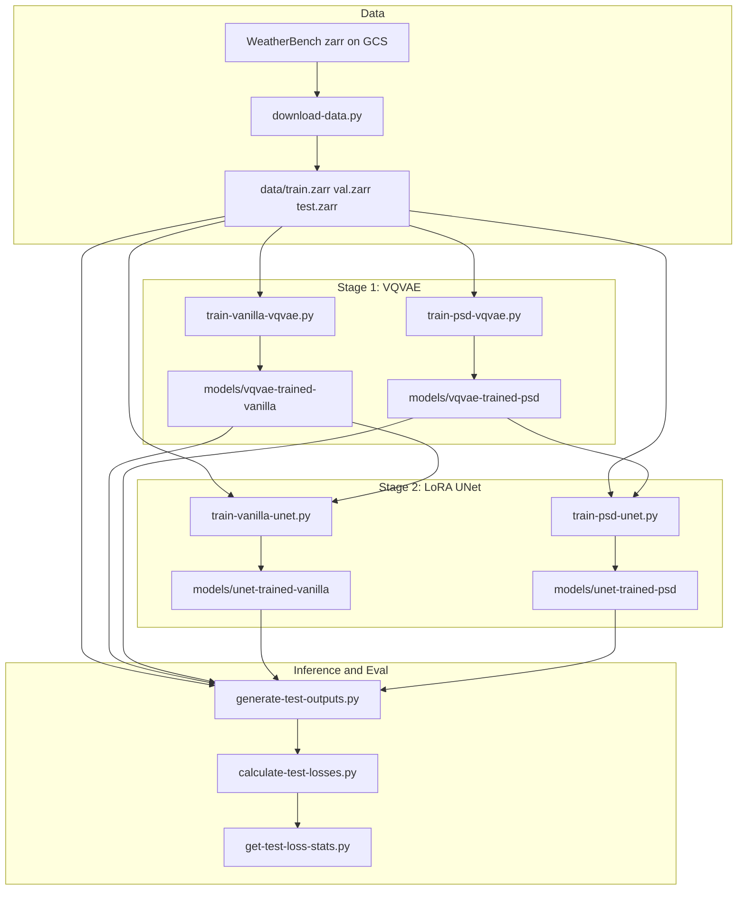

# Weather Forecast Downscaling — Frequency-Informed Latent Diffusion Super-Resolution

End-to-end pipeline that adapts a CompVis 4× LDM for multichannel ERA5 weather fields, fine-tunes VQVAE + LoRA UNet on zarr data, and evaluates pixel + spectral fidelity across four inference configurations.

**Python** · **PyTorch** · **CUDA** · **HuggingFace Diffusers** · **DDIM** · **VQVAE** · **LoRA/PEFT** · **xarray/zarr** · **GCS** · **Cartopy** · **FFT/PSD loss**

|             |                                                                                                                                             |
| ----------- | ------------------------------------------------------------------------------------------------------------------------------------------- |
| **Dataset** | [WeatherBench subset (GCS)](https://console.cloud.google.com/storage/browser/weather_bench_subset_hr_lr) — 4-channel ERA5 patches, 4× LR→HR |
| **Paper**   | [Paper (Google Drive)](https://drive.google.com/file/d/1381gV7N1_kLo-IVBy7FBkaIiD5wiwgtE/view)                                              |

---

## Problem

Numerical weather prediction (NWP) requires expensive supercomputers and scales poorly to high regional resolution. Machine-learning weather prediction (MLWP) offers a data-driven alternative: models like CorrDiff use diffusion to downscale global forecast fields to km-scale regional outputs. This project asks whether a latent diffusion model (LDM) originally trained for natural-image super-resolution can generalize to gridded meteorological data, and whether a frequency-informed power spectral density (PSD) loss can mitigate the low-frequency bias of standard MSE training.

---

## What We Built

- **Data pipeline:** GCS zarr download ([`download-data.py`](download-data.py)), ERA5 patch extraction and 4× coarsening utilities ([`data_zarr_utils.py`](data_zarr_utils.py))
- **Model adaptation:** 4-channel VQVAE/UNet factories + LoRA config ([`utils.py`](utils.py)) from `CompVis/ldm-super-resolution-4x-openimages`
- **Custom PSD loss:** Patch-based Hann-windowed FFT PSD with latitude-aware `dx` ([`isotropic_fpsd_loss.py`](isotropic_fpsd_loss.py))
- **Two-stage training:** Standard vs PSD-VQVAE (20 epochs) → Standard vs PSD-UNet with frozen VQVAE latents (10 epochs, LoRA)
- **Inference pipeline:** Custom LDM super-resolution with two latent-init strategies ([`weather_downscaling_pipeline.py`](weather_downscaling_pipeline.py))
- **Evaluation harness:** Test output generation, per-sample MSE/PSD, aggregated stats CSVs, Cartopy visualization scripts

---

## System Architecture



### Two inference strategies

[`weather_downscaling_pipeline.py`](weather_downscaling_pipeline.py) supports two latent initialization modes (paper §III.E):

| Strategy    | Init latents                        | Label in eval                                          |
| ----------- | ----------------------------------- | ------------------------------------------------------ |
| Recommended | Gaussian noise                      | `standard-LDM (recommended)` / `PSD-LDM (recommended)` |
| Custom      | Bilinear upsample LR → VQVAE encode | `standard-LDM (custom)` / `PSD-LDM (custom)`           |

The custom strategy (interpolate + encode) produced significantly lower MSE than the recommended noise initialization — a key finding documented in the [paper](https://drive.google.com/file/d/1381gV7N1_kLo-IVBy7FBkaIiD5wiwgtE/view).

### Dataset parameters

| Parameter          | Value                                     |
| ------------------ | ----------------------------------------- |
| Spatial patch      | 32° × 32° over North America              |
| HR resolution      | 128 × 128 (0.25°)                         |
| LR resolution      | 32 × 32 (1.0°)                            |
| Downscaling        | 4× block-mean                             |
| Channels           | 10m wind (u, v), 2m temperature, MSLP     |
| Train / val / test | 20k / 4.2k / 4.2k samples (paper Table I) |

---

## Engineering Decisions

| Decision                          | Rationale                                                                                                                                   |
| --------------------------------- | ------------------------------------------------------------------------------------------------------------------------------------------- |
| LDM super-resolution base         | Pretrained 4× image SR pipeline ([CompVis LDM](https://huggingface.co/CompVis/ldm-super-resolution-4x-openimages)); paper §III.A            |
| WeatherBench zarr subset          | Freely available ERA5 benchmark; 32°×32° NA patches, HR 128×128 / LR 32×32 (paper Table I)                                                  |
| PSD loss on VQVAE only            | Frequency bias mitigation during latent encoding; μ=0.13 (paper Table II, [`train-psd-vqvae.py`](train-psd-vqvae.py))                       |
| LoRA UNet fine-tuning             | 3.51% trainable params; attention + ResNet conv targets (paper Table II, [`utils.py`](utils.py))                                            |
| Custom latent initialization      | Major MSE gains vs noise init; documented finding in [paper](https://drive.google.com/file/d/1381gV7N1_kLo-IVBy7FBkaIiD5wiwgtE/view) §III.E |
| Per-channel z-score normalization | Channels are different physical quantities with different ranges                                                                            |
| Patch Hann windows + overlap      | Mitigate spectral leakage on equirectangular grids (paper §III.D)                                                                           |

---

## Results

Evaluated on the held-out test set (4,200 samples). Best model in **bold**.

### VQVAE reconstruction (normalized MSE, median)

| Model          | Wind U    | Wind V    | 2m Temp   | MSLP      |
| -------------- | --------- | --------- | --------- | --------- |
| Standard VQVAE | 0.053     | 0.051     | 0.033     | 0.016     |
| **PSD-VQVAE**  | **0.045** | **0.046** | **0.023** | **0.013** |

### Full pipeline (normalized MSE, median)

| Pipeline                   | Wind U    | Wind V    | 2m Temp   | MSLP      |
| -------------------------- | --------- | --------- | --------- | --------- |
| **PSD-LDM (custom)**       | **0.084** | **0.080** | **0.258** | **0.337** |
| standard-LDM (custom)      | 0.129     | 0.100     | 0.362     | 0.622     |
| PSD-LDM (recommended)      | 0.653     | 0.566     | 0.362     | 0.375     |
| standard-LDM (recommended) | 0.727     | 0.574     | 0.348     | 0.371     |

Custom inference dominates recommended noise initialization on MSE across all channels. PSD training yields modest but consistent gains on both VQVAE and full LDM (paper §IV.B). Wind velocity fields are predicted more accurately than 2m temperature and MSLP. Training ran on a single NVIDIA RTX 2000 Ada (16GB VRAM).

---

## Repository Map

```
# Data
download-data.py          # GCS → local zarr splits
import_data.py            # Remote zarr exploration snippet
data_zarr_utils.py        # Patch extraction, 4× coarsening, Cartopy viz

# Training
train-vanilla-vqvae.py    # MSE + VQ commit loss (20 epochs)
train-psd-vqvae.py        # MSE + commit + PSD loss (20 epochs)
train-vanilla-unet.py     # LoRA UNet on vanilla VQVAE latents (10 epochs)
train-psd-unet.py         # LoRA UNet on PSD VQVAE latents (10 epochs)

# Inference
weather_downscaling_pipeline.py   # WeatherLDMSuperResolutionPipeline (DDIM, 100 steps)
generate-test-outputs.py          # Run pipeline on test set → .pt tensors
generate-test-vqvae-reconstructions.py  # VQVAE-only HR reconstructions

# Evaluation & visualization
calculate-test-losses.py          # Per-sample MSE + PSD vs ground truth
get-test-loss-stats.py            # Aggregate pipeline test losses → CSV
get-vqvae-loss-stats.py           # Aggregate VQVAE reconstruction losses → CSV
plot-test-losses.py               # Boxplots across 4 pipeline variants
plot-pipeline-outputs.py          # Cartopy maps: LR vs prediction vs target
plot-presentation-test-outputs.py # Multi-pipeline comparison maps
plot-presentation-losses.py       # Presentation-style loss plots
plot-report-loss-curves.py        # VQVAE + UNet train/val curves
plot-report-vqvae-reconstructions.py
plot-test-vqvae-reconstructions.py
plot-train-loss-curve.py

# Shared
utils.py
isotropic_fpsd_loss.py
data/                             # zarr splits (gitignored — download locally)
models/                           # checkpoints (gitignored — train locally)
evaluation/losses/                # Per-sample test loss CSVs
evaluation/test_loss_stats/       # Aggregated pipeline stats
evaluation/vqvae_loss_stats/      # Aggregated VQVAE stats
evaluation/test_outputs/          # Generated tensors (gitignored)
plots/                            # Figure output (gitignored)
```

---

## Running the Pipeline

**Requirements:** NVIDIA GPU + CUDA · Python 3.12+

```bash
pip install -r requirements.txt
pip install peft cartopy   # required but not pinned in requirements.txt

# 1. Download data (skip if data/ already populated)
python download-data.py

# 2. Train VQVAE then UNet (vanilla track shown; swap for psd scripts)
python train-vanilla-vqvae.py
python train-vanilla-unet.py

# 3. Generate test outputs (custom inference — default)
python generate-test-outputs.py \
  --vqvae models/vqvae-trained-vanilla/vqvae-trained-vanilla.pt \
  --unet models/unet-trained-vanilla/unet-trained-vanilla.pt \
  --output evaluation/test_outputs/vanilla

# 4. Evaluate
python calculate-test-losses.py \
  --input evaluation/test_outputs/vanilla \
  --output evaluation/losses/vanilla.csv
python get-test-loss-stats.py

# 5. Visualize
python plot-test-losses.py
python plot-pipeline-outputs.py --pipeline vanilla
```

Training scripts default to a CSIL scratch `DATA_PATH`; uncomment `DATA_PATH = Path("data")` in each training script for local runs. Pass `--noise-latents` to `generate-test-outputs.py` for the recommended (Gaussian noise) inference strategy.

---

## Scope & Limitations

- We used a subset of available WeatherBench training data (~1/3 of the full corpus — see paper §V.A). Research prototype, not production-hardened (no serving layer or operational forecast integration).
- Fine-scale reconstruction still has room for improvement vs ground truth; PSD loss yields marginal but measurable gains.
- PSD loss uses local overlapping FFT patches with Hann tapering, not spherical harmonics (future work in paper §V.A).

---

## Authors

**Adam Podoxin** · **Sviatoslav Rublov** · **Israel Olmos Lau**

- Paper: [Weather Forecast Downscaling Using a Frequency Informed Latent Diffusion Model (Google Drive)](https://drive.google.com/file/d/1381gV7N1_kLo-IVBy7FBkaIiD5wiwgtE/view)
- GitHub: https://github.com/AdamPodoxin/diffusion-weather-downscaling
